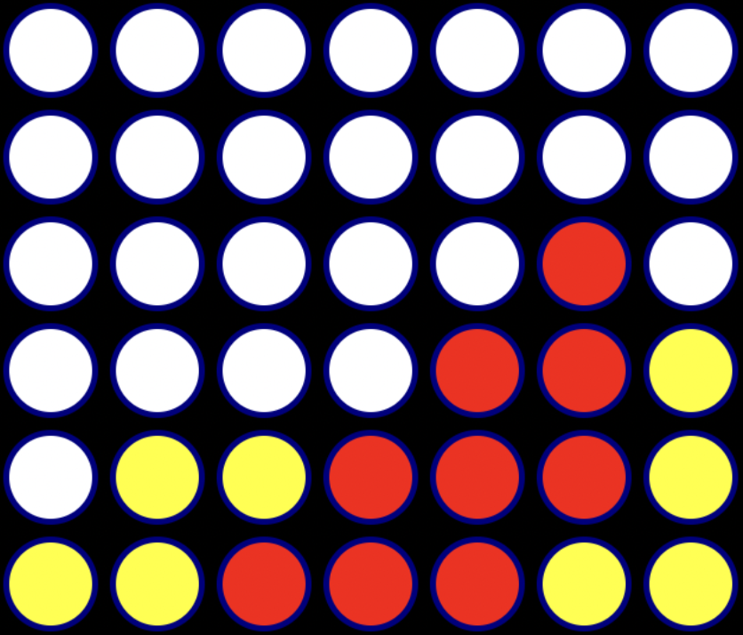
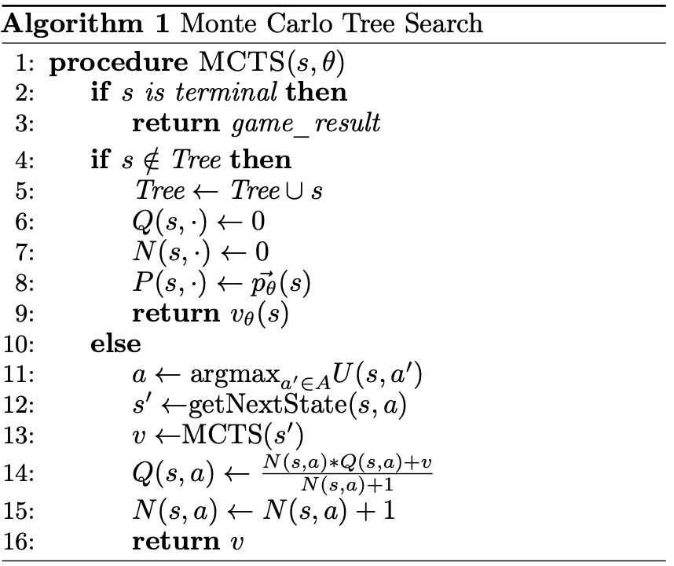
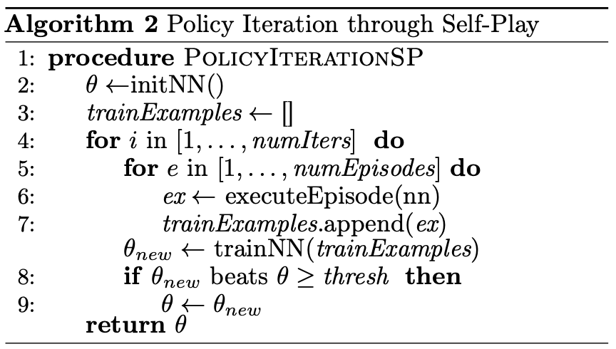
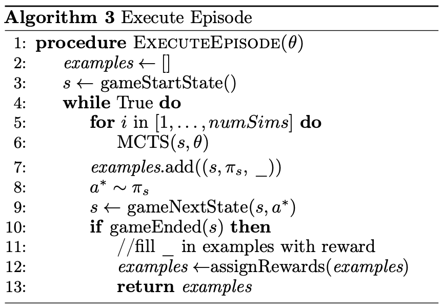

# AlphaZero

AlphaZero and MCTS algorithm applied to game of TicTacToe and ConnectFour
<p align="center">
  
</p>
<p align="center"><i>(Image used for thumbnail purposes only)</i></p>

```bash
Starting game of ConnectFour(rows=6, cols=7, in_a_row=4) with 10 rounds

============ Results ============

| Agent                | Wins | Draws |
|----------------------|------|-------|
| MCTSAgent_1          | 0    | 0     |
| AlphaZeroAgent_2     | 10   | 0     |
```

This is a concise and from scratch implementation of AlphaZero algorithm applied to game of TicTacToe and ConnectFour for the purpose of learning and experimenting with the algorithm.


<p align="center">
  
</p>
<p align="center">
  
  
</p>

## Usage

Run the `play_game.py` file to play a game with settings defined in `config/players.yaml` file.

```bash
python play_game.py
```

### Features:

Choose any 2 Players from following list by uncommenting any of the `player_1` and `player_2` settings in `config/players.yaml`:

- Random
- MCTS
- Human
- AlphaZero

Select a game by uncommenting `game: TicTacToe` or `game: ConnectFour`

Run tournament of N rounds by setting `num_rounds: N`

To view the game in action, set `show_games: true`

To view the end state of the game, set `show_end_state: true`

View a summary of the tournament after N round.

### Training

Set the training parameters in the `config/training_conf.yaml` file. and start training using following command

```bash
python train_AlphaZero.py
```

## Installation

1. Create new environment [optional]

    ```bash
    conda create -n alpha_zero python=3.10
    conda activate alpha_zero
    ```

2. Install supported version of PyTorch
3. Install requirements

    ```bash
    pip install -r requirements.txt
    ```

### Acknowledgements

- [DeepMind AlphaZero Papar](https://github.com/keras-rl/keras-rl/blob/master/examples/alpha_zero/README.md) - for the amazing paper and detailed explanation of the algorithm
- [Simple Alpha-Zero blog](https://suragnair.github.io/posts/alphazero.html) - for their intuitive explanation and pseudo code
- [AlphaZeroFromScratch](https://github.com/foersterrobert/AlphaZeroFromScratch) - for their Easy to understand MCTS and AlphaZero implementations
- [alpha-zero-general](https://github.com/suragnair/alpha-zero-general/tree/master) - for their implementation
